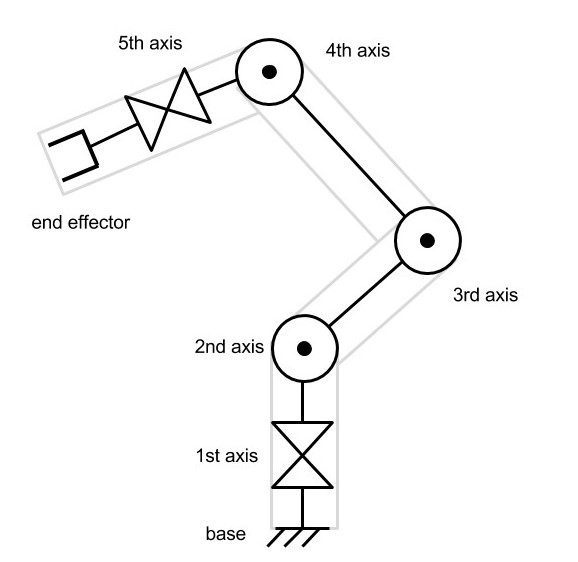

# Graphical_Unity_Solutions
Here it will be implemented the graphical side of the octoguy simulation implementation.

## Understanding forward kinematics
Originally the inverse kinematics was develop for robotics, so the terminology is derivative from that context. For each joint we have a degree of freedom, that is, a numeric value necessary for describing the system state. 

<div style = 'text-align:center'>



**Figure 1**: Robot with 6 degrees of freedom.

</div>

The end effector can be counted or not as a degree of freedom. As we want the arm to reach this point so he will not be, as we will give this point to the engine and the other degrees of freedom will be calculated.
When we give the state of each degree of freedom and from that we acquire the **end effector** state, that is called **Forward kinematics**. It is an easy and explicite problem.
It cam be expressed mathematically as:


<div style='text-align:center'>

$
P_i = P_{i-1} + rotate \left( D_i,P_{i-1},\sum_{k=0}^{i-1}\alpha_k   \right)
$

</div>

So the position of a point is equal to the position of the previous point plus the movement caused from the rotation of the last points. This can be calculated with a Unity function that take the distance from the point, the point and the rotations as arguments. 

In unity we can cause a game object to inherit the parent position, rotation and scale with parenting. The bones, if imported correctly from blender will come already with the right parenting relations.

For the backward kinematics this isn't enough, we will need to simulate this without moving the bones for implementing the **Inverse Kinematics Gradient Descent**. So we will need to implement an mathematical approach so that we can test the states without to much computations stress.

The implementation can be seen ahead. A script was created on each bone called **RobotJoint**:
```csharp

public class RobotJoint : MonoBehaviour
{
    public Vector3 Axis;
    public Vector3 StartOffset;

    void Awake()
    {
        StartOffset = transform.localPosition;
        Axis = new Vector3(1,1,1);
    }

}

```
It is a sensor that only returns the directions in witch the bone can rotate with `Axis` and the point from where the rotation occurs `StartOffset`.

Then there is other script that can be placed in the root of the armature. It contains the FowardKinematics and backward kinematics routines and is the principal controller of this puppet. Ahead we can see the FowardKinematic function that takes the information from the sensors and output the position of the end of the Leg.

```csharp

public class IK_manager : MonoBehaviour
{
    // For the bones identification
    public GameObject Bone_L;
    public GameObject Bone2_L;
    public GameObject Bone3_L;
    public GameObject Bone4_L;
    private GameObject[] Leg_1_L;
    
    void awake()
    {
        Leg_1_L = new GameObject[4]{Bone_L, Bone2_L, Bone3_L, Bone4_L};
    }

    public Vector3 FowardKinematics(float[] angles, GameObject[] Leg)
    {
        
        // Acquiring a list of scripts
        RobotJoint[] JointScript = new RobotJoint[Leg.Length];
        for (int i = 0; i < Leg.Length; i++)
        {
            JointScript [i] = Leg[i].GetComponent ("RobotJoint") as RobotJoint;
        }

        // Applying the rotation
        Quaternion rotation = Quaternion.identity;
        Vector3 prevPoint = Leg[0].transform.position;
        for (int i = 1; i < Leg.Length; i++)
        {
            //Rotate around a new axis
            rotation *= Quaternion.AngleAxis(angles[i-1], JointScript[i-1].Axis);
            Vector3 nextPoint = prevPoint + rotation * JointScript[i].StartOffset;

            prevPoint = nextPoint;
        }

        // Returns the endpoint
        return prevPoint;
    }
}

```

## Understanding gradient descent
Now that we can calculate the position of the end of the leg, it's possible to calculate the distance from it to the target with the function:

```csharp
public float DistanceFromTarget(Vector3 target, float [] angles, GameObject[] Leg)
{
Vector3 point = FowardKinematics (angles, Leg);
return Vector3.Distance(point, target);
}
```

And now, to solve the problem we just need to reduce this value. For that we will use gradient descent, that is a numeric method to reduce an output changing a set of inputs. There are other methods, even analytical ones as we rave a describing equation. Further research is needed. But, for now, we will see the numeric approach.

Thiss method just look at the gradient of the given function. Then it moves in the direction to which the function output decreases, that is, where the derivative is negative. But there are times where the derivative isn't in reach. Then we sample points around the one we are analyzing to see the direction where the error function decreases. For that we use:

<div style='text-align:center'>

$
f^\prime (p) = \lim_{\Delta x \rightarrow 0} \frac{f(p+\Delta x) - f(p)}{\Delta x} 
$

</div>

When we found the direction in which the gradient descends, we move:

<div style='text-align:center'>

$
p_{i+1} = p_i - L \Delta f(p_i)
$

</div>

Where `L` is the Learning rate.

# Active Ragdoll physics
This technique is capable of creating physics based procedural animations.
This is done by making the mesh obey the laws of motion, with collisions support.
Not just that, but the bones of our character react to impacts and forces.
And, besides this, it is possible to make internal forces to move the character in the environment.
Such approach is known as physic based animations.


